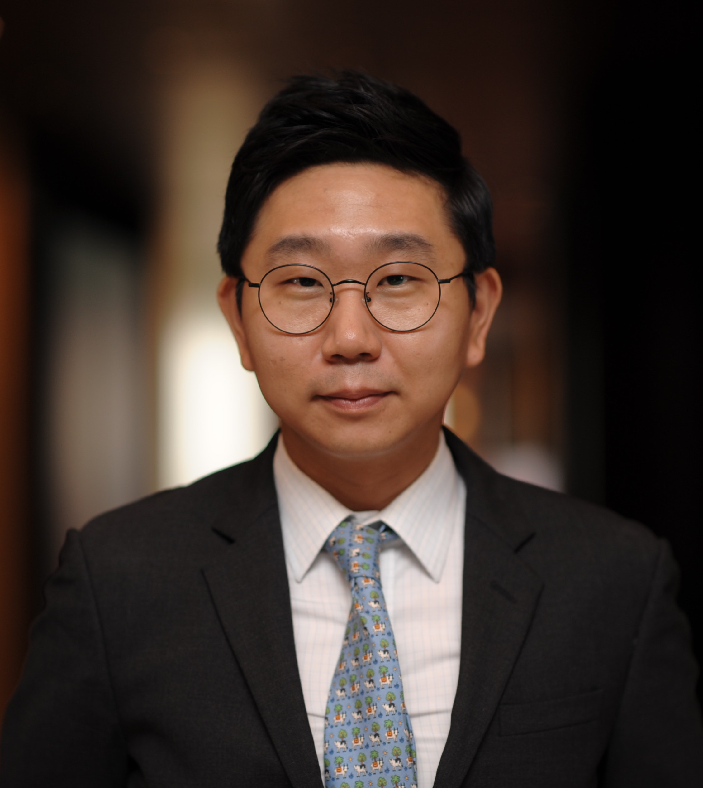

<h1 style="font-size: 40px; margin-bottom: 10px;">JOONSEOK YANG</h1>

Associate Professor

Department of Political Science & Diplomacy

Sungkyunkwan University

  

    
    
✉️ jsyang01@skku.edu

    
📞 82-02-760-0381

  

  

    
I am an Associate Professor in the Department of Political Science & Diplomacy at Sungkyunkwan University, Seoul, South Korea. My research interests lie at the intersection of interest group politics, public opinion, domestic and foreign policy, and quantitative and experimental methods, especially in comparative contexts. Specifically, my current and future research agendas focus on two main substantive themes: (1) whether and how business affects policy-making processes and (2) how citizens evaluate domestic and foreign policies and how this translates into voting decisions. My work is forthcoming or has appeared in the <em>American Journal of Political Science</em>, <em>British Journal of Political Science</em>, <em>Comparative Political Studies</em>, <em>Journal of Policy Analysis and Management</em>, and <em>World Development</em>, among others.

    
I completed my Ph.D. in Political Science at Columbia University. Prior to graduate school, I worked as a legislative staff in the National Assembly of the Republic of Korea for over two years. I received an M.A. in International Affairs (2012) from the School of International & Public Affairs (SIPA), Columbia University, and a B.A. in Political Science and French from Yonsei University in Seoul, South Korea. I currently serve as a policy advisor to the Ministry of Foreign Affairs, Republic of Korea.

  

